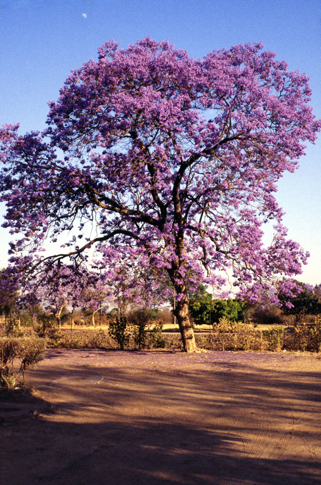

# Grace Gilbert (gracegi): L-system Jacaranda Tree

## Demo Link
https://gracelgilbert.github.io/hw04-l-systems/

## Inspiration
I was inspired by the Jacaranda tree, a tree that grows in southern Africa, as well as Central and South America.

There are two main elements that I particularly liked about these trees. The first is their bright purple flowers, distinguishing them from typical green trees. The second is their curved, winding branches. I tried to incorporate these elements into my L-system.

## Resources
- I looked at the CIS 460 slides, along with CIS 566 lecture slides, for examples of grammars.
- I looked at the webgl obj loader documentation to load obj files: https://github.com/frenchtoast747/webgl-obj-loader
- I used this 2D L-system generator to experiment with ideas for my grammar: http://www.kevs3d.co.uk/dev/lsystems/

## Implementation
### L-system Structure
The L-system is made up of various compnents:
- Axiom: the base string that will be expanded
- Current turtle: This turtle keeps track of its position, orientation, and recursion depth. The drawing functions use these values to place and transform geometry in the scene.
- Stack of turtles: Allows a turtle to be saved and returned to later to create branching.  When saving a turtle, the current turtle is pushed onto the stack. When restoring a turtle, a turtle is popped off the stack and is set to be the current turtle.
- Expansion Rules: a map from characters to expansion rules. An expansion rule is a class that contains a list of output strings and a list of corresponding probabilities for each output string. When queried for an output, the expansion rule chooses one of the output strings according to their probabilities.
- Drawing Rules: a map from characters to drawing rules. A drawing rule is similar to an expansion rule, but instead of outputting a string, it outputs a function. These functions are the functions that place geometry elements or update the turtle state.
- Final String: the string after a given number of expansions of the axiom.  This string is then traversed and each character gets mapped to a drawing rule that is run, constructing the tree.

### Grammar
The tree that I created is an instance of my L-system class, where I set all of the elements to produce my particular tree.
#### Expansion Rules
- Axiom: "FFFFX"
- X maps to: 
  - "[2FFFFrXp]Fr[1FFFFrXp]FFFFXp" with probability 0.34,
  - "[3FFFFrXp]Fr[4FFFFrXp]FFFFXp" with probability 0.34,
  - "[5FFFFrXp]Fr[6FFFFrXp]FFFFXp" with probability 0.3, and 
  - "Fp" with probability 0.02.
- F maps to: 
  - "F" with probability 0.75,
  - "FF" with probability 0.05, and 
  - "FFF" with probability 0.2.
- The remaining characters, [, ], 1, 2, 3, 4, 5, 6, r, and p all map to themselves with probability 1.0
#### Drawing Rules
- F maps to the function that places a thin section of branch. This function gets the transformation matrix out of the current turtle and pushes that matrix onto a list of matrices that will then be used as instance value transformations for the branch geometry. The function also updates the state of the turtle. It moves the turtle forward by a distance of 0.37, it increases the recursion depth slightly by a randomized amoun, and if the turtle is moving below a certain height threshold, it kills that turtle so the turtle does not continue to travel too low. Increasing the recursion depth causes the branch to thin out as it extends, as depth is used to scale down the branch sections. Note that each drawing step only adds a thin sliver of branch, which is why it was necessary to have F expand to multiple F's, and to have longer strings of F's in the branching expansions.
- 1, 2, 3, 4, 5, and 6 all map to rotation functions. These functions rotate the current turtle about one of its three axes, up, forward, and right. For each direction, there is a positive rotation and a negative rotation. The amount of rotation is randomized by adding a random value between 0 and 5 to a rotation of about 70 degrees. These rotation functions cause the branches to branch out in different directions, growing the tree in all different directions. The amount in which the branches rotate is scaled by the depth.  The branches rotate less as the depth increases, causing wider spread initially, but straighter branching as the branches become thinner.
- r maps to a randomized rotation function. This function rotates the turtle in a completely random direction by a small amount. This function is called in before and/or after many of the F's in the string, causing twisting and winding as the branches extend. The turtle has a boolean value that keeps track of whether it is part of the main trunk of the tree. If the current turtle is part of the chunk, the random rotation is scaled down to avoid having an unrealistically winding trunk.
- [ and ] map to save and restore functions respectively. The save function pushes a copy of the current turtle onto the turtle stack so it can be returned to later, and the restore function sets the current turtle to the turtle that was popped off the stack, going back to a previous state to branch off of it.
- p maps to a function that places flowers. Within this function, there is a chance that no flowers will be placed. If the depth of the current turtle is less than 10, no flowers will be placed, preventing flowers from being placed low down when the tree is not expanded many iterations. If the depth is larger than 10, there is then a probability of a flower being drawn. This probability depends on the age of the tree. The younger the tree, the higher the probability of placing a flower, and vice versa, making the tree "shed" its flowers as it ages. If, given the probability, a flower is to be drawn, I then generate a random integer between 1 and 3 and draw that many flowers, each with a random offset rotation from the orientation of the turtle, creating little clusters of flowers. 
- X maps to an empty function that is a placeholder, as X's main purpose is to expand the string.

### Modifiability
- The user can modify how many times the initial axiom is expanded. More expansions causes more branching.
- The user can modify the age of the tree within a range from 0 to 1. The younger the tree, the brighter the flower color is, and the flowers are more dense. As the age value changes, I interpolated between a varied bright purple color and a varied brown color so that the flowers brown linearly with age. 
- Within the vertex shader, I animate the tree using a value generated with 3-dimensional FBM. The wind goes left and right along the x axis along a sinusoidal animation curve. The intensity of the wind is scaled along y so that the lower portion of the tree doesn't move at all, and it gradually becomes more prominant further up the tree.  The user can adjust the speed of this wind.

### Geometry
I modeled the branch segment and flower in Maya and exported them as obj files.

### Background
The background consists of a gradiant of sunset colors that are offset with FBM noise to create a clouded blending. This is done in screenspace.

## Things to Improve
- Occasionally, a tree will generate that is just a stump with no branches, or just a couple branches. I think this is due to the fact that I kill branches if they get too low so they don't go through the ground, but sometimes it kills branches prematurely. A potential solution to this would be to only kill these branches if the turtle is pointing downward. Another possibility would be to bias the branches to point upwards rather than killing them at all.
- Right now, the wind affects the entire tree mostly evenly. The FBM creates a slight variation, but this variation is not dependent on the geometry at all. Something that could make the wind more dynamic would be to have an instanced wind value, so each branch for example could have its own wind based on say thickness, height, and position. The flowers could also have different wind values, making them flutter faster than the branches for example
